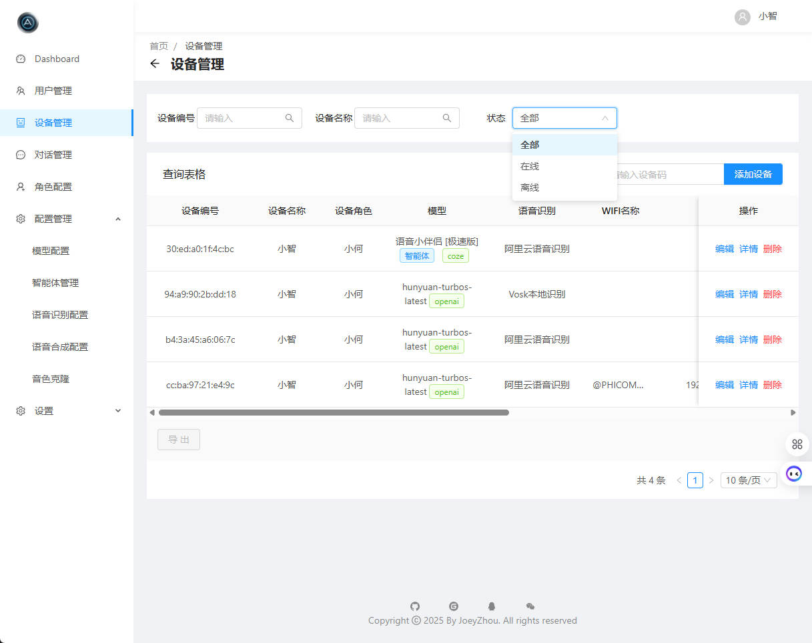
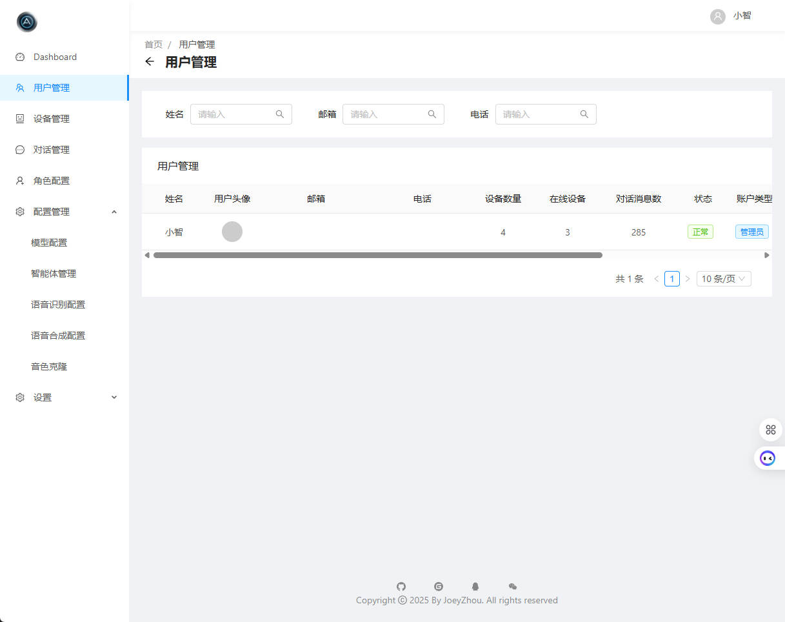
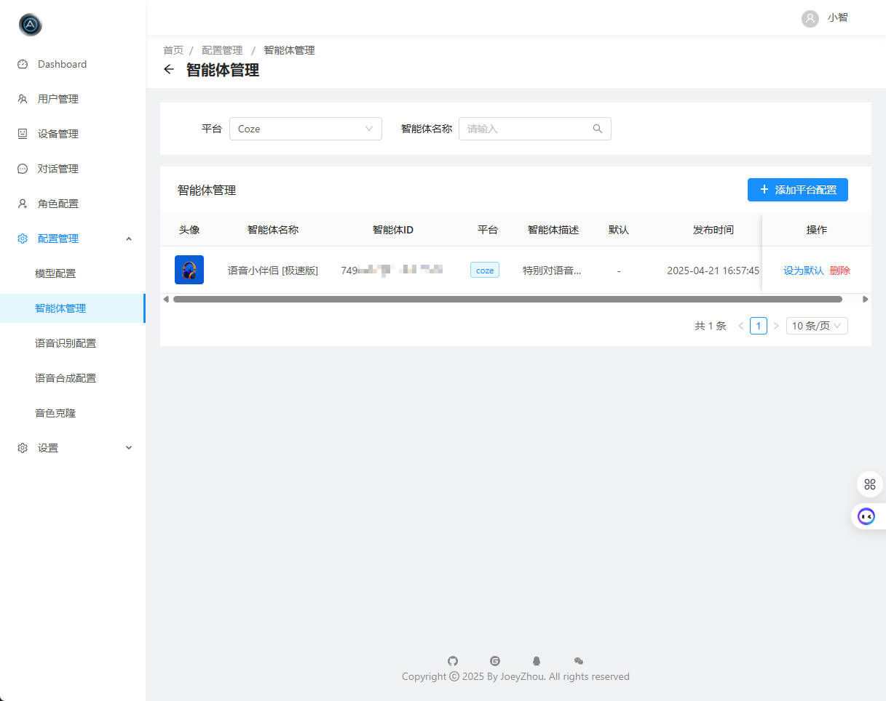
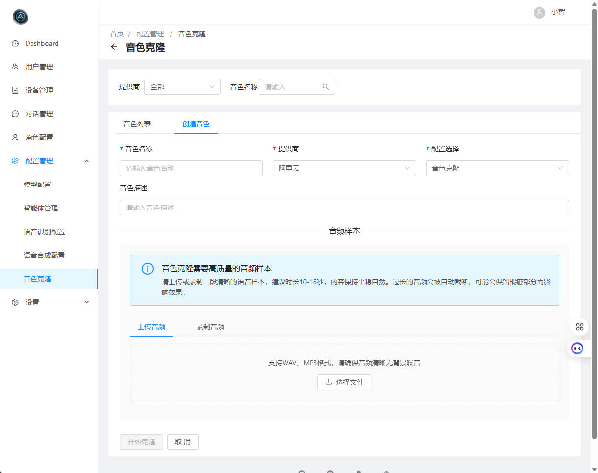

<h1 align="center">Xiaozhi ESP32 Server Java</h1>

  基于 <a href="https://github.com/78/xiaozhi-esp32">Xiaozhi ESP32</a> 项目开发的 Java 版本服务端，包含完整前后端管理平台 
  为智能硬件设备提供强大的后端支持和直观的管理界面

  <a href="https://github.com/joey-zhou/xiaozhi-esp32-server-java/issues">反馈问题</a>
  · <a href="#deployment">部署文档</a>
  · <a href="https://github.com/joey-zhou/xiaozhi-esp32-server-java/blob/main/CHANGELOG.md">更新日志</a>

  
  
  
  
  

---

## 项目简介 📝

Xiaozhi ESP32 Server Java 是基于 [Xiaozhi ESP32](https://github.com/78/xiaozhi-esp32) 项目开发的 Java 版本服务端，包含完整的前后端管理平台。该项目旨在为用户提供一个功能丰富、操作便捷的管理界面，帮助用户更好地管理设备、配置等。

考虑到企业级应用场景的需求，Java 作为一种成熟的企业级开发语言，具备更完善的生态系统支持和更强大的并发处理能力，因此我们选择开发这个 Java 版本的服务端，为项目提供更多可能性和扩展空间。

- **后端框架**：Spring Boot + WebFlux
- **前端框架**：Vue.js + Ant Design
- **数据存储**：MySQL
- **全局响应式**：适配各种设备及分辨率

---

## 适用人群 👥

如果您已经购买了 ESP32 相关硬件，且希望通过一个功能完善、界面友好的管理平台来控制和管理您的设备，那么本项目非常适合您。特别适合：

- 需要企业级稳定性的用户
- 个人开发者，希望快速搭建使用的用户
- 希望有完整前端管理界面的用户
- 需要更强大数据管理和分析能力的用户
- 对系统扩展性有较高要求的用户
- 需要支持大量设备并发连接的场景
- 对实时数据处理有高要求的应用场景

---

## 功能模块 ✨

### 已完成功能 ✅

| 功能模块 | 状态 | 描述 |
|---------|------|------|
| **设备管理** | ✅ | 查看已接入的所有设备列表、设备状态实时监控、添加/编辑/删除设备信息、设备绑定自动应用默认设置 |
| **音色选择** | ✅ | 提供多种音色模板、预览音色效果、为不同设备分配不同音色配置 |
| **音色克隆** | ✅ | 支持火山引擎与阿里云音色克隆，实现个性化声音定制 |
| **聊天记录** | ✅ | 查看历史聊天记录、按日期/关键词搜索聊天内容、删除消息、清空记忆功能 |
| **智能体** | ✅ | 对接Coze与Dify等智能体平台，实现复杂场景对话能力 |
| **角色切换** | ✅ | 预设角色切换（AI老师、男/女朋友、智能家居助手等）支持语音切换角色 |
| **持久化对话** | ✅ | 支持持久化对话记录，方便查看历史对话内容 |
| **LLM多平台支持** | ✅ | 支持OpenAI、智谱AI、讯飞星火、Ollama等多种大语言模型 |
| **默认配置管理** | ✅ | 支持设置默认配置，新绑定设备自动应用默认设置 |
| **IoT设备控制** | ✅ | 支持通过语音指令管理IoT设备，实现智能家居控制 |
| **智能功能调用** | ✅ | 支持音乐播放（音乐服务由第三方提供，仅供个人娱乐使用，本项目不承担任何版权责任）、角色切换等功能的智能调用
| **多语音识别服务** | ✅ | 支持Funasr、阿里、腾讯、Vosk等多种语音识别服务 |
| **双向流式交互** | ✅ | 支持实时语音输入和实时回复输出，提高对话流畅度 |
| **本地离线识别** | ✅ | 支持Vosk本地离线语音识别，无需联网即可使用 |
| **WebSocket通信** | ✅ | 高性能WebSocket通信，支持设备实时状态更新和控制 |
| **非阻塞响应式处理** | ✅ | 基于WebFlux的非阻塞响应式处理，提高系统吞吐量 |
| **自动语音唤醒** | ✅ | 支持自定义唤醒词，无需按键即可激活设备 |
| **多设备同时接入** | ✅ | 支持多设备同时接入，实现全屋语音覆盖 |
| **TTS多引擎支持** | ✅ | 支持微软、阿里、火山等多种TTS引擎 |
| **多用户支持** | ✅ | 支持多用户配置，满足家庭多成员使用需求 |

### 开发中功能 🚧

| 功能模块 | 状态 | 描述 |
|---------|------|------|
| **聊天数据可视化** | 🚧 | 聊天频率统计图表等数据可视化功能 |
| **混合模式角色** | 🚧 | 支持多角色混合模式，通过不同唤醒词唤醒不同角色（自动切换） |
| **记忆管理** | 🚧 | 自定义记忆对话条数、历史对话总结/摘要功能、手动操作对话记录 |
| **实时打断** | 🚧 | 支持实时打断功能，提高对话流畅度 |
| **声纹识别** | 🚧 | 支持声纹识别功能，实现个性化语音助手 |
| **多语言支持** | 🚧 | 支持多语言界面，满足不同地区用户需求 |
| **设备分组** | 🚧 | 支持设备分组管理，方便设备分类和管理 |
| **Function Call** | 🚧 | 支持LLM函数调用功能，实现复杂任务处理和智能决策 |
| **Home Assistant** | 🚧 | 支持智能家居设备控制，通过语音指令管理Home Assistant设备 |
| **多模态交互** | 🚧 | 支持图像识别和处理，实现更丰富的交互方式 |
| **情感分析** | 🚧 | 通过语音情感分析，提供更人性化的回复 |
| **语音活动检测** | 🚧 | 优化VAD检测，提高语音识别准确率 |
| **多设备协同** | 🚧 | 支持多设备协同工作，实现全屋覆盖的语音助手系统 |
| **MQTT通信** | 🚧 | 支持MQTT通信协议，实现设备间的消息传递 |
| **自定义插件系统** | 🚧 | 支持自定义插件开发，扩展系统功能 |
| **知识库集成** | 🚧 | 支持接入外部知识库，增强问答能力 |
| **语音提醒与闹钟** | 🚧 | 支持设置语音提醒和闹钟功能 |
| **远程控制** | 🚧 | 支持远程控制设备，实现外出时的设备管理 |

---

## UI 展示 🎨

    
    
<strong>设备管理</strong> - 全面管理和监控所有连接设备

  

    <strong>👉 点击查看更多界面截图 👈</strong>
  

  
  

    
    
<strong>登录界面</strong> - 安全访问系统的入口

    
    
<strong>仪表盘</strong> - 系统概览和关键数据展示

    
    
<strong>用户管理</strong> - 管理用户信息和权限

    
    
<strong>消息记录</strong> - 查看和搜索历史对话内容

    
    
<strong>模型管理</strong> - 配置和管理AI模型

    
    
<strong>智能体管理</strong> - 设置和切换智能体，Coze/Dify

    
    
<strong>角色管理</strong> - 设置和切换AI角色

    
    
<strong>音色克隆</strong> - 克隆自己的声音，实现个性化语音助手

  

---

## 部署文档 📚

我们提供了多种部署方式，以满足不同用户的需求：

### 1. 本地源码运行

- [Windows部署文档](./docs/WINDOWS_DEVELOPMENT.md) - 适合Windows环境开发和测试 - 由群友"汇合"提供
- [CentOS部署文档](./docs/CENTOS_DEVELOPMENT.md) - 适合Linux服务器环境部署 - 由群友"汇合"提供

成功运行后，控制台会输出 OTA 和 WebSocket 连接地址，根据固件编译文档使设备接入服务使用。

### 2. Docker部署

- [Docker部署文档](./docs/DOCKER.md) - 快速容器化部署方案 - 由群友"💍Mr_li"提供

成功启动后，WebSocket 连接需要通过宿主IP进行通信，例如：`ws://192.168.31.100:8091/ws/xiaozhi/v1/`

### 3. 视频教程

- [视频部署教程](https://doc.sivitacraft.com/article/xiaozhiai-javaserver/) - 由群友成员"苦瓜"录制

### 4. 固件编译

- [固件编译文档](./docs/FIRMWARE-BUILD.md) - 详细的固件编译和烧录过程

烧录成功且联网成功后，通过唤醒词唤醒小智，留意 server 端输出的控制台信息。

---

## 技术特点 🛠️

- **企业级架构**：采用Spring Boot框架，提供稳定可靠的后端服务
- **响应式编程**：基于WebFlux的非阻塞响应式编程模型，显著提升系统吞吐量和并发处理能力
- **响应式前端**：基于Vue.js和Ant Design构建，适配各种设备屏幕
- **高性能通信**：优化的WebSocket实现，支持实时数据交互和双向流式传输
- **数据持久化**：MySQL数据库存储，确保数据安全和高效查询
- **模块化设计**：松耦合架构，便于功能扩展和维护
- **安全机制**：完善的用户认证和权限管理
- **可视化监控**：直观的数据展示和设备状态监控
- **多LLM支持**：支持OpenAI、智谱AI、讯飞星火、Ollama等多种大语言模型
- **Function Call**：强大的函数调用功能，支持复杂任务处理和智能决策
- **IoT设备集成**：支持智能家居设备的接入和控制，实现全屋智能化
- **智能功能调用**：支持音乐播放、角色切换等功能的智能调用
- **多语音识别引擎**：支持多种语音识别服务，满足不同场景需求
- **流式语音交互**：支持实时语音输入和输出，提供更自然的对话体验
- **离线语音识别**：支持本地离线语音识别，保护隐私并提高响应速度
- **高并发处理**：优化的线程模型，支持多设备同时接入和处理
- **事件驱动架构**：基于事件驱动的架构设计，提高系统响应性和扩展性
- **资源利用优化**：更高效的资源利用，降低系统负载
- **低延迟处理**：针对实时交互场景的低延迟处理机制

---

## 开发路线图 🗺️

根据我们的[项目开发需求清单](https://github.com/users/joey-zhou/projects/1)，未来我们计划实现以下功能：

### 近期计划 (2025 Q2)
- 完善Function Call功能，支持更多复杂任务处理
- 实现多角色混合模式，支持不同唤醒词唤醒不同角色
- 优化记忆管理系统，提供更灵活的历史对话管理
- 实现聊天数据可视化功能，提供数据分析能力

### 中期计划 (2025 Q3-Q4)
- 实现声纹识别功能，支持个性化语音助手
- 完善Home Assistant集成，提供更全面的智能家居控制能力
- 开发多模态交互功能，支持图像识别和处理
- 实现自定义插件系统，支持功能扩展

### 长期计划 (2026+)
- 开发多设备协同工作机制，实现全屋覆盖的语音助手系统
- 实现情感分析功能，提供更人性化的交互体验
- 开发知识库集成功能，增强问答能力
- 实现多用户支持，满足家庭多成员使用需求

我们将根据社区反馈和技术发展不断调整开发计划，确保项目持续满足用户需求。

---

## 贡献指南 👐

欢迎任何形式的贡献！如果您有好的想法或发现问题，请通过以下方式联系我们：

### 微信

微信群超200人无法扫码进群，可以加我微信备注 **小智** 我拉你进微信群

### QQ

欢迎加入我们的QQ群一起交流讨论，QQ群号：790820705

### 定制开发

我们接受各种定制化开发项目，如果您有特定需求，欢迎通过微信联系洽谈。

---

## Star History 📈

<a href="https://www.star-history.com/#joey-zhou/xiaozhi-esp32-server-java&Date">
 <picture>
   <source media="(prefers-color-scheme: dark)" srcset="https://api.star-history.com/svg?repos=joey-zhou/xiaozhi-esp32-server-java&type=Date&theme=dark" />
   <source media="(prefers-color-scheme: light)" srcset="https://api.star-history.com/svg?repos=joey-zhou/xiaozhi-esp32-server-java&type=Date" />
   
 </picture>
</a>